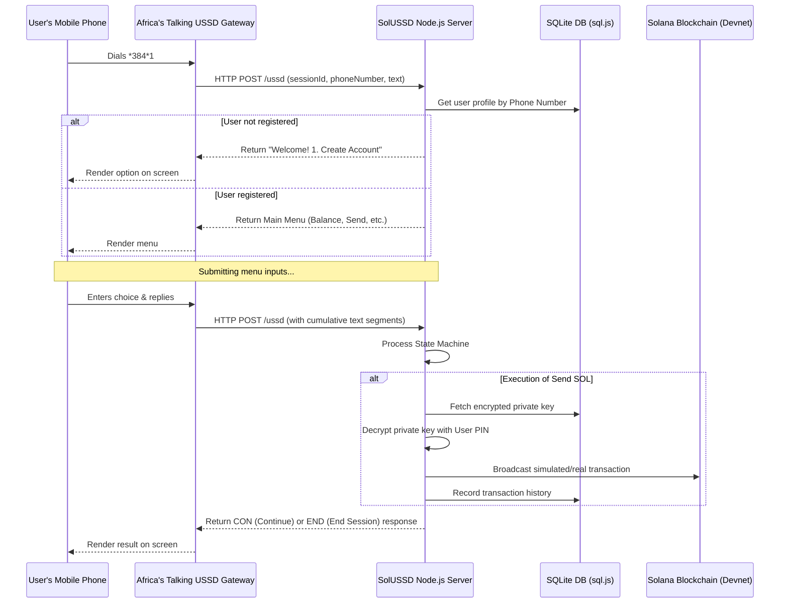

# SolUSSD — Solana USSD Gateway for Nigeria

Access the Solana blockchain from any phone using USSD. No internet connection, no smartphone, and no crypto experience required. Built for Superteam Nigeria.

> [!NOTE]
> This prototype runs on **Solana Devnet** (free test SOL). It uses a hybrid custodial wallet model where Solana private keys are generated on the server and encrypted using a 4-digit user PIN and a master encryption key.

---

## Table of Contents
1. [Overview & Target Audience](#overview--target-audience)
2. [Features](#features)
3. [Architecture & Flow](#architecture--flow)
4. [Security & Key Management](#security--key-management)
5. [Getting Started](#getting-started)
6. [Web Simulator](#web-simulator)
7. [Africa's Talking USSD Gateway Integration](#africas-talking-ussd-gateway-integration)

---

## Overview & Target Audience

In Nigeria, over **40% of the population** does not have access to a smartphone or mobile internet, yet nearly everyone has a mobile phone capable of calling and using USSD codes (e.g., `*384*1#`). 

**SolUSSD** bridges this gap by bringing the speed, low cost, and power of the Solana blockchain to simple feature phones. Users can create a wallet, check their balance, fund their wallet (Devnet), and send or receive SOL payments through a secure, interactive menu system.

---

## Features

- **No Internet Required**: Works on any GSM network using basic USSD transport protocol.
- **PIN-Secured**: Every transaction or balance check is validated against the user's secret 4-digit PIN.
- **Instant Finality**: Leveraging Solana's sub-second transaction validation.
- **Complete Wallet Lifecycle**:
  - Create wallet address
  - Query balance
  - Send SOL to any base58 Solana address
  - Receive SOL with a displayable wallet address
  - Check transaction history (last 5 transactions)
  - Fund wallet (Devnet simulation/airdrop)
- **Built-in Web Simulator**: A premium responsive dashboard showing a simulated feature phone that connects to the real backend.

---

## Architecture & Flow



---

## Security & Key Management

Because USSD is a text-based transport protocol, user client-side wallets (like Phantom) cannot be run on feature phones. SolUSSD utilizes a secure **custodial wallet architecture**:

1. **Key Generation**: When a user registers, a real Solana public/private keypair is generated using `@solana/web3.js` on the server.
2. **Key Derivation**: The user sets a secret 4-digit PIN. We derive a 256-bit encryption key by hashing the server's master key (`ENCRYPTION_KEY` from `.env`) concatenated with the user's PIN:
   $$\text{AES Key} = \text{SHA-256}(\text{Master Key} + \text{User PIN})$$
3. **AES-256-GCM Encryption**: The Solana private key is encrypted using AES-256-GCM with a unique initialization vector (IV) and authentication tag.
4. **PIN Hashing**: The 4-digit PIN is hashed using `bcrypt` and saved in the database for validating balance checks and transaction authorization.
5. **Zero-Trace Storage**: The raw Solana private key is **never** saved to the database. It exists in memory only during keypair decryption to authorize a transaction.

---

## Getting Started

### Prerequisites
- Node.js (v18+)
- NPM

### Installation
1. Clone the project files to your server.
2. Install npm dependencies:
   ```bash
   npm install
   ```
3. Copy the environment template and configure your values:
   ```bash
   cp .env.example .env
   ```
4. Start the server:
   ```bash
   npm start
   ```

The server runs by default at `http://localhost:5500`.

---

## Web Simulator

The project includes a stunning, premium web simulator that connects to the backend API:
1. Open `http://localhost:5500` in your web browser.
2. Click the **"*384*1# ->"** button or type it in the phone's input field and click **Reply** to start your session.
3. Follow the prompts on the screen using the virtual keypad or your keyboard.
4. You can see real-time updates and balance changes reflected instantly.

---

## Africa's Talking USSD Gateway Integration

To deploy this live in Nigeria:
1. Register for an account on [Africa's Talking](https://africastalking.com/).
2. Request a USSD Service Code (e.g., `*384*1#` or a shared channel).
3. Set your Callback URL to your live server's endpoint:
   `https://your-domain.com/ussd` (Must be HTTPS).
4. The backend server is fully compliant with the Africa's Talking payload schema and expects the following parameters in the `POST` request body:
   - `sessionId` (String)
   - `serviceCode` (String)
   - `phoneNumber` (String)
   - `text` (String - cumulative asterisks)

Your server will respond with `Content-Type: text/plain` with the `CON ` or `END ` prefix.
